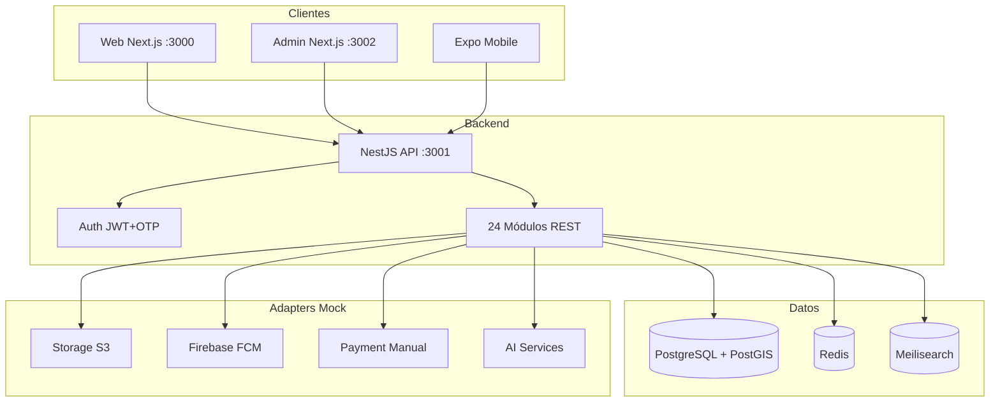

# Lefrig — Arquitectura

## Diagrama general



## Monorepo

```
pnpm workspaces + Turborepo
├── apps/api       → NestJS, Prisma
├── apps/web       → Next.js App Router
├── apps/admin     → Next.js, panel SaaS
├── apps/mobile    → Expo Router
├── packages/shared → Enums, tipos, Zod schemas
├── packages/ui    → Design tokens + componentes React **(web-only)**
└── packages/config → TSConfig, ESLint flat config, Prettier
```

### Lint / ESLint

Config flat en [`packages/config/eslint/base.mjs`](../packages/config/eslint/base.mjs). Cada app/paquete tiene `eslint.config.mjs` y el script `lint` ejecuta ESLint + (donde aplica) `tsc --noEmit`. CI job `lint` cubre shared, ui, web, admin, api y mobile.

## Backend — NestJS

### Capas
- **Controllers** — REST endpoints, validación DTO
- **Services** — Lógica de negocio
- **Prisma** — Acceso a datos
- **Guards** — JWT + Roles
- **Adapters** — Storage, FCM/Expo Push, Redis, Meilisearch, Payment (mock en dev)

### Módulos REST

| Prefijo | Responsabilidad |
|---------|-----------------|
| `/auth` | OTP, JWT, refresh |
| `/users` | Perfil, roles |
| `/camps` | Campamentos |
| `/locations` | Dairas, barrios, marsas, puntos, rutas |
| `/categories` | Categorías listing/service |
| `/listings` | Marketplace CRUD, favoritos, reportes |
| `/cash` | Acuerdos, confirmaciones PIN, recibos |
| `/services` | Directorio servicios |
| `/shops` | Tiendas, productos |
| `/orders` | Pedidos tienda/diáspora |
| `/transport` | Solicitudes, conductores |
| `/jobs` | Empleo |
| `/diaspora` | Perfil + pedidos diáspora |
| `/vouchers` | _(desmontado del producto — esquema histórico)_ |
| `/messages` | Chat REST (WebSocket-ready) |
| `/notifications` | Push FCM abstraction |
| `/reviews` | Reviews + TrustScoreService |
| `/moderation` | Reportes, logs |
| `/disputes` | Mediación |
| `/needs` | Necesidades + SmartMatching mock |
| `/community` | Posts comunitarios |
| `/analytics` | Agregados sin PII |
| `/admin` | Dashboard, verificación |

### Auth
- **Producción:** Clerk JWT → sync usuario en PostgreSQL (`POST /auth/sync`)
- **Dev legacy:** teléfono + OTP mock (`123456`) con JWT interno (`AUTH_LEGACY_JWT=true`)
- Webhook Clerk: `POST /auth/clerk/webhook` (Svix)
- Access token JWT legacy (15m) + refresh token (7d)
- Roles en `publicMetadata` de Clerk y array `roles` en DB
- Guards: `AuthGuard` (Clerk + legacy), `RolesGuard`

### Búsqueda y caché
- **Meilisearch:** índice `listings`, sync al arrancar (`MEILI_SYNC_ON_BOOT`), reindex admin `POST /admin/search/reindex`
- **Redis:** caché campamentos (5 min), rate-limit OTP (8/hora por teléfono)

### Seguridad
- bcrypt para refresh tokens
- Zod/class-validator en DTOs
- Rate-limit OTP vía Redis (8 solicitudes/hora por teléfono)
- AdminAccessLog para acceso a libretas/disputas
- Fiado/vouchers desmontados del runtime; no mezclar con cash/reputación

## Base de datos — Prisma + PostgreSQL

50+ modelos incluyendo:
- Geografía: Camp → Daira → Neighborhood → MarketArea → PickupPoint → Route
- Comercio: Listing, Shop, ShopProduct, Order, OrderItem
- Pagos: CashAgreement, CashConfirmation, CashReceipt, ManualPayment
- Crédito: CreditAccount, CreditEntry, CreditPayment, CreditAgreement
- Logística: TransportRequest, DriverProfile, FrequentRoute
- Confianza: Review, UserBadge, Report, Dispute
- Comunidad: CommunityPost, NeedRequest, NeedOffer
- ONG: VoucherProgram, Voucher, VoucherTransaction
- Futuro: EscrowTransaction (mock), AnalyticsEvent

PostGIS-ready: campos `latitude`/`longitude` en ubicaciones.

## Frontend

### Web (`apps/web`)
- Next.js 14 App Router
- `@lefrig/ui` componentes + tokens inline
- Fetch API con fallback demo
- SEO metadata, responsive, RTL ready

### Admin (`apps/admin`)
- Sidebar SaaS premium
- Tablas con filtros por campamento
- Badges de estado, moderación inline
- Dashboard métricas agregadas

### Mobile (`apps/mobile`)
- Expo Router file-based
- AsyncStorage: cache listados, borradores, cola offline
- 6 acciones home grandes
- Flujos: voz mock, libreta, Tindouf, PIN confirmación

## Offline-first (Mobile)

```
Acción usuario → ¿Online?
  Sí → API directa → cache local
  No → Cola local (AsyncStorage) → sync al reconectar
```

Modos: solo texto, sin imágenes, compresión agresiva.

## IA-ready

`AiService` mock con interfaces:
- `transcribeVoice()` — publicar por voz
- `translateText()` — árabe/español/francés
- `suggestCategory()` — categorización automática
- `improveListing()` — título/descripción
- `detectSpam()` — moderación
- `suggestPrice()` — precio sugerido
- `publishAssistant()` / `shopAssistant()` / `diasporaAssistant()`

TODO: conectar OpenAI/Whisper/local models con credenciales.

## Escalabilidad futura

- Redis: cache sesiones, rate limit, colas BullMQ
- Meilisearch: búsqueda full-text listings/shops/services
- WebSocket: chat en tiempo real (Socket.io o WS nativo)
- S3/R2: imágenes producción
- FCM: push notifications reales
- PostGIS: búsqueda geográfica marsas/puntos
- Escrow: pago retenido mock → integración real futura

## Decisiones técnicas

| Decisión | Razón |
|----------|-------|
| Monorepo TS | Tipos compartidos, UI consistente |
| NestJS modular | 24 dominios, guards, DI |
| Prisma | Schema tipado, migraciones, seed |
| OTP mock dev | Sin SMS provider inicial |
| Adapters mock | S3/FCM/Payment sin credenciales |
| Inline styles UI | Compartir entre web y evitar Tailwind duplicado |
| Expo | Cross-platform, OTA updates futuro |
